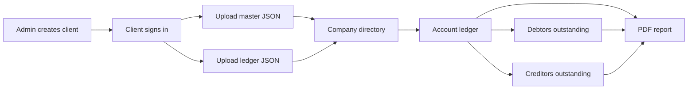

# Ledger

<p align="center">
  A secure, multi-tenant account statement portal for managing company ledgers,
  bill-wise outstanding balances, and client data.
</p>

<p align="center">
  
  
  
  
  
</p>

## Overview

Ledger is a full-stack web application that lets businesses securely share account
statements with their clients. An administrator manages client accounts, while every
client gets an isolated workspace for uploading company master data and ledger entries.

The application connects master records and transactions through a shared `CODE`,
making it easy to search companies, inspect account statements, calculate bill-wise
outstanding balances, and export reports as PDFs.

## Highlights

- **Multi-tenant access** — each client can view and manage only their own data.
- **Role-based authentication** — separate admin and client experiences using JWT
  sessions stored in HttpOnly cookies.
- **JSON data import** — replace master and ledger datasets through a simple upload
  workflow.
- **Search and category filters** — find accounts by code, name, city, amount, or
  business category.
- **Detailed account statements** — review dated debit, credit, and balance entries for
  each company.
- **Debtors outstanding** — bill-wise collection tracking for customer accounts
  (`MAIN_CODE = SDR`).
- **Creditors outstanding** — bill-wise payment tracking for supplier accounts
  (`MAIN_CODE = SCR`).
- **Overdue analysis** — configure due days and instantly flag overdue bills.
- **PDF exports** — download ledger, debtor, or creditor reports from the browser.
- **Client administration** — create and remove clients, including their associated
  master and ledger data.
- **Responsive interface** — dark glassmorphism UI designed for desktop and mobile.

## Application Flow



## Core Screens

| Screen | Purpose |
| --- | --- |
| **Company Directory** | Search and filter uploaded company master records. |
| **Company Ledger** | View dated transactions with debit, credit, and balance values. |
| **Debtors Outstanding** | Track collectible customer bills and overdue days. |
| **Creditors Outstanding** | Track payable supplier bills and overdue days. |
| **Client Management** | Allow the admin to create or remove client accounts. |

## Tech Stack

| Area | Technology |
| --- | --- |
| Frontend | Next.js 15 App Router, React 19, TypeScript |
| Styling | Tailwind CSS 4 |
| Backend | Next.js Route Handlers |
| Database | MongoDB with Mongoose |
| Authentication | JWT, HttpOnly cookies, `jsonwebtoken`, `jose` |
| HTTP client | Axios |
| PDF generation | jsPDF and jsPDF-AutoTable |
| Analytics | Vercel Analytics |
| Deployment | Vercel |

## Data Model

Ledger uses three primary collections:

- **Users** store login details, role, and client metadata.
- **Master records** store one document per company, owned by a client.
- **Ledger records** store multiple transactions per company.

`Master.CODE` and `Ledger.CODE` connect each company with its transaction history.

```text
User
 ├── Master records
 │    └── Company identified by CODE
 └── Ledger records
      └── Transactions linked by CODE
```

## Getting Started

### Prerequisites

- Node.js 20 or later
- npm
- A MongoDB database

### Installation

```bash
git clone https://github.com/karamveersingh22/ledger.git
cd ledger
npm install
```

Create a `.env` file in the project root:

```env
MONGODB_URL=your_mongodb_connection_string
secret=your_strong_jwt_secret
```

Start the development server:

```bash
npm run dev
```

Open [http://localhost:3000](http://localhost:3000) in your browser.

## JSON Import Format

The application accepts two JSON arrays:

```json
[
  {
    "CODE": 1001,
    "ACCOUNT_N": "Example Company",
    "MAIN_CODE": "SDR",
    "CITY": "New Delhi",
    "YR_BAL": 25000
  }
]
```

```json
[
  {
    "CODE": 1001,
    "DATE": "2026-01-15",
    "BOOK": "SALE",
    "BILL": "INV-001",
    "DESCRIBE": "Goods sold",
    "DEBIT": 10000,
    "CREDIT": 0,
    "BALANCE": 35000
  }
]
```

Additional fields supported by the Mongoose schemas may also be included. Sample import
files are available as [`mas.json`](./mas.json) and [`lgr.json`](./lgr.json).

## Project Structure

```text
app/
├── api/                 Authentication, data, and admin endpoints
├── company/[code]/      Ledger and outstanding views
├── login/               Client and admin login
├── manage/              Client management
└── page.tsx             Company directory and data upload
dbconfig/                MongoDB connection
lib/                     Authentication and seed helpers
models/                  Mongoose schemas
middleware.ts            Route-level access control
```

## Available Scripts

| Command | Description |
| --- | --- |
| `npm run dev` | Run the Turbopack development server. |
| `npm run build` | Create a production build. |
| `npm run start` | Serve the production build. |
| `npm run lint` | Run the configured lint command. |

## Security Notes

This project is currently suitable for development and portfolio demonstration. Before
using it in production:

- hash passwords instead of storing or comparing plaintext values;
- protect all client pages at the server or middleware layer;
- validate and sanitize uploaded JSON records;
- replace all seeded credentials and use a strong JWT secret;
- standardize ownership references across master and ledger collections.

## Roadmap

- Password hashing and stronger account security
- Schema-based validation for uploaded files
- Consistent owner references across collections
- Server-side protection for every private page
- Automated tests for authentication, imports, and outstanding calculations

## Author

Developed by [Karamveer Singh](https://github.com/karamveersingh22).

If you find this project useful, consider giving the repository a star.
